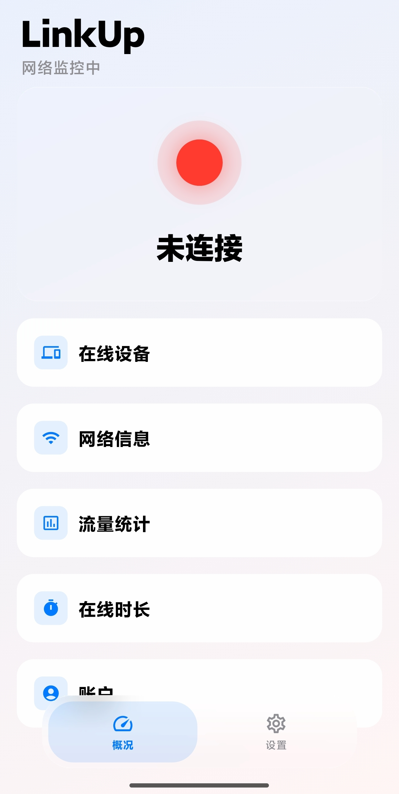
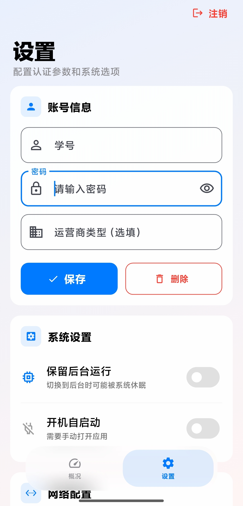
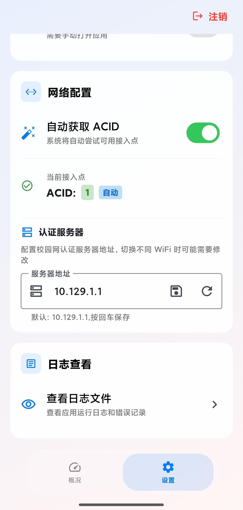
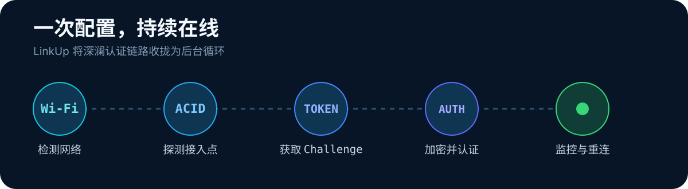
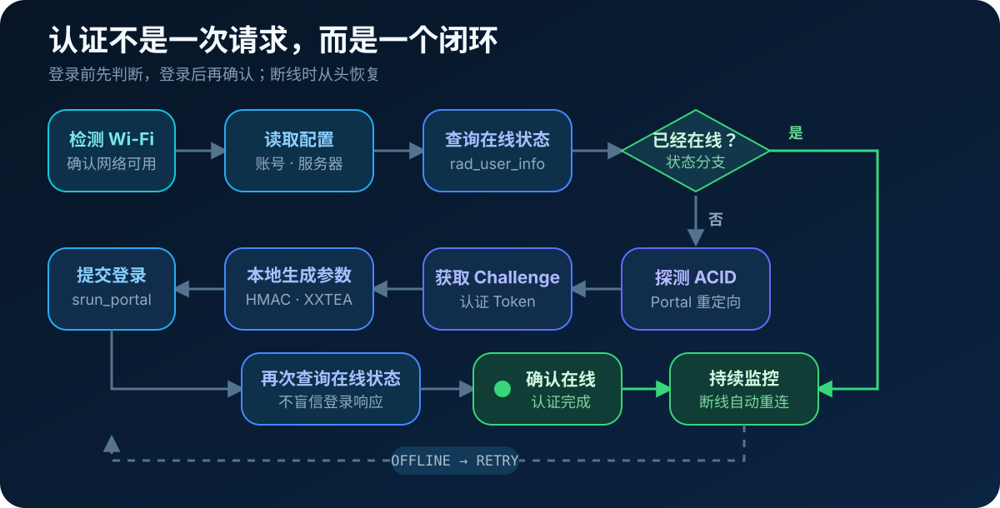

<p align="center">
  
</p>

<p align="center">
  <a href="https://github.com/mel0nyrame/LinkUp/releases"></a>
  
  
  <a href="LICENSE"></a>
</p>

LinkUp 是一个面向 **深澜（Srun）校园网**的 Android 自动认证客户端。配置一次账号后，它会检测网络状态、自动探测 ACID、完成登录，并在断网时尝试重新连接。

> [!NOTE]
> LinkUp 是基于公开协议实现的第三方客户端，与深澜官方无关。

## 界面预览

<p align="center">
  <a href="./assets/main_screen.jpg"></a>&nbsp;
  <a href="./assets/setting_screen.jpg"></a>&nbsp;
  <a href="./assets/setting_screen_2.jpg"></a>
</p>

<p align="center"><sub>概况与网络状态 · 账号与系统选项 · ACID 与认证服务器配置</sub></p>

## 它解决什么

- **自动认证** — 连接校园 Wi‑Fi 后自动完成深澜登录流程。
- **断网重连** — 周期检测网络状态，离线时自动尝试恢复连接。
- **自动探测 ACID** — 从 Portal 重定向链和登录页面识别接入点，无需逐个试值。
- **状态一目了然** — 查看 IP、流量、在线时长和在线设备。
- **适合后台运行** — 支持后台保活、开机自启与错误日志，便于长期使用和排障。

<p align="center">
  
</p>

## 开始使用

### 安装 APK

1. 前往 [Releases](https://github.com/mel0nyrame/LinkUp/releases) 下载最新 APK。
2. 在 Android 设备上允许安装来自此来源的应用并完成安装。
3. 首次启动时填写学号或工号、密码；ACID 建议保持“自动获取”。

进入概况页后，LinkUp 会自动检测并认证。下拉页面可立即触发一次手动刷新。

### 从源码构建

需要 Flutter SDK；本项目当前在 `pubspec.yaml` 中使用 Dart SDK `^3.12.0-239.0.dev`。

```bash
git clone https://github.com/mel0nyrame/LinkUp.git
cd LinkUp
flutter pub get
flutter build apk --release
```

构建产物位于 `build/app/outputs/flutter-apk/app-release.apk`。

## 工作原理

<p align="center">
  
</p>

1. **登录前判断**：检测 Wi‑Fi、读取配置，并通过 `rad_user_info` 查询当前状态；已经在线则直接进入监控。
2. **离线时认证**：自动探测 ACID、获取 Challenge，在本地通过 HMAC-MD5、XXTEA、自定义 Base64 与 SHA-1 生成认证参数，再提交登录。
3. **登录后确认**：再次查询 `rad_user_info`，而不是仅依赖 Portal 的成功响应；监控发现断线后重新进入认证流程。

## 平台与限制

| 平台 | 支持情况 | 说明 |
| --- | --- | --- |
| Android | ✅ 主要支持平台 | 包含后台保活与开机自启 |
| iOS | ⚠️ 尚未适配 | 暂不提供可用版本 |
| Windows / macOS / Linux | ⚠️ 尚未适配 | 暂不提供可用版本 |
| Web | ❌ 不支持 | 浏览器网络权限不满足认证需求 |

部分 Android ROM 会限制后台活动。若自动重连在切到后台后停止，请同时：

1. 在 LinkUp 的“系统设置”中开启保留后台运行；
2. 将 LinkUp 加入系统电池优化白名单；
3. 在系统设置中允许自启动（部分小米、华为、OPPO、vivo 设备需要额外授权）。

## 常见问题

<details>
<summary><strong>提示“WiFi 未开启”</strong></summary>

请确认设备已连接需要认证的校园 Wi‑Fi。LinkUp 不会通过移动数据执行校园网认证。
</details>

<details>
<summary><strong>登录失败并提示 ACID 错误</strong></summary>

优先将 ACID 模式切换为“自动获取”。若当前网络无法完成自动探测，再向学校网络中心确认接入点 ID 后手动填写。
</details>

<details>
<summary><strong>应用切到后台后不再自动重连</strong></summary>

开启“保留后台运行”，并检查系统的电池优化、自启动和后台活动权限。不同厂商的限制策略可能不同。
</details>

<details>
<summary><strong>如何查看错误日志</strong></summary>

可在应用的日志卡片中查看。Android 上日志文件位于应用私有目录 `app_flutter/error.log`，通常无法由普通文件管理器直接访问。
</details>

## 开发

```bash
flutter analyze     # 静态分析
flutter test        # 运行测试
```

当 `RadUserInfo` 的 JSON 模型发生变化时，重新生成序列化代码：

```bash
flutter pub run build_runner build --delete-conflicting-outputs
```

## 致谢

LinkUp 使用 [Flutter](https://flutter.dev/) 构建，并参考了以下开源项目对深澜协议的实现：

- [1328411791/GDOUYJ_Internet_Client](https://github.com/1328411791/GDOUYJ_Internet_Client)
- [CyLzzh/srun_client](https://github.com/CyLzzh/srun_client)
- [Mmx233/BitSrunLoginGo](https://github.com/Mmx233/BitSrunLoginGo)

## Skills

本仓库的 `.opencode/` 目录中包含若干 OpenCode Skill，用于辅助开发与文档维护。这些 Skill 不参与 LinkUp 的运行时逻辑，仅在本地工具链中使用。各 Skill 的版权归其作者所有，本仓库按各自许可证条款使用。

| Skill | 用途 | 来源 | 许可证 |
| --- | --- | --- | --- |
| beautify-github-readme | 设计 README 视觉系统与信息结构 | [oil-oil/beautify-github-readme](https://github.com/oil-oil/beautify-github-readme) | [MIT](https://github.com/oil-oil/beautify-github-readme/blob/main/LICENSE) © 2026 oil-oil |

## 许可与免责声明

本项目采用 [MIT License](LICENSE) 开源，仅供学习和个人使用。请遵守所在学校的网络管理规定；使用本工具产生的后果由使用者自行承担。
