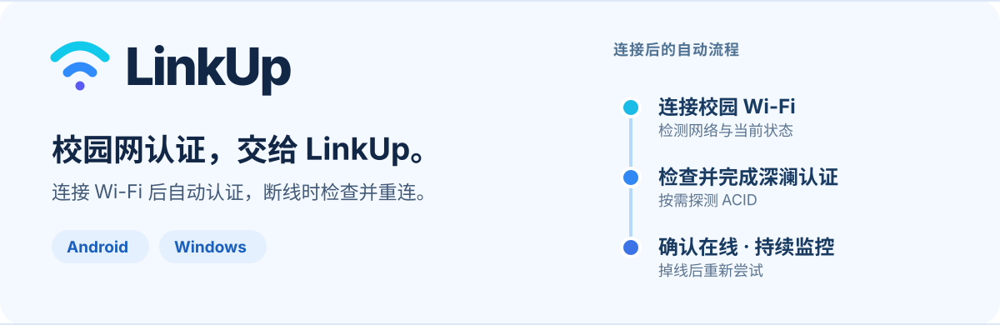
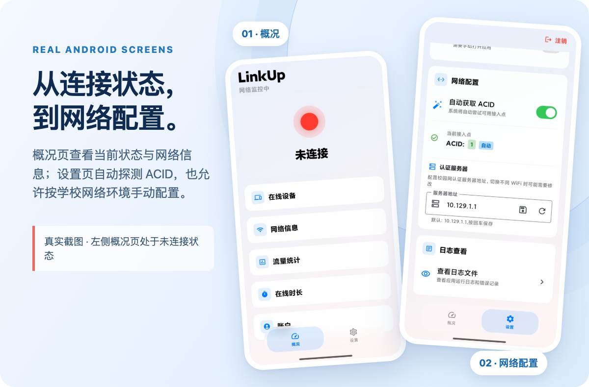
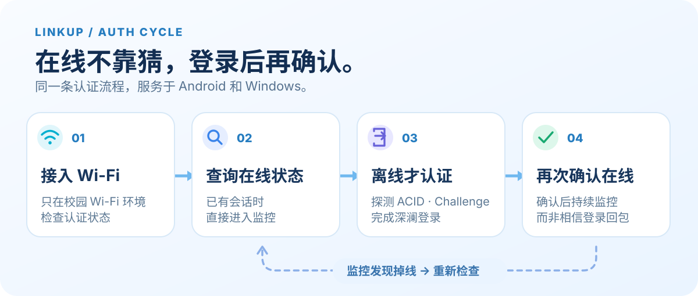

<p align="center">
  
</p>

LinkUp 面向使用**深澜（Srun）认证**的校园网。保存账号后，它会在连接校园 Wi-Fi 时检查在线状态，按需探测 ACID、完成认证，并在运行期间监控连接、尝试断线重连。

**[下载 Android APK / Windows 安装器](https://github.com/mel0nyrame/LinkUp/releases/latest)** · [查看认证原理](#它如何保持连接) · [从源码构建](#从源码构建)

> [!NOTE]
> LinkUp 是基于公开协议实现的第三方客户端，与深澜官方无关。实际可用性取决于学校的认证环境。

## 真实界面

<p align="center">
  
</p>

以上是 **Android 客户端的真实截图**，左侧概况页处于未连接状态。可分别打开 [完整概况页](./assets/main_screen.jpg) 和 [完整网络配置页](./assets/setting_screen_2.jpg) 查看细节。Windows 客户端的操作入口见下文。

## 下载与开始使用

- **Android**：在 [Releases](https://github.com/mel0nyrame/LinkUp/releases/latest) 下载 `linkup.apk`。应用打开时运行；可开启“保留后台运行”以在离开界面后继续监控。
- **Windows**：在 [Releases](https://github.com/mel0nyrame/LinkUp/releases/latest) 下载 `LinkUp-Setup-<版本>.exe`。提供主窗口与系统托盘；可在设置中开启登录自启。

1. 安装对应平台的文件，并连接需要深澜认证的校园 Wi-Fi。
2. 在 LinkUp 中保存学号或工号、密码。ACID 建议先保持**自动获取**；如学校使用不同认证服务器，再修改服务器地址。
3. 返回概况页查看认证状态。Android 可下拉手动刷新；Windows 可点“立即检查”或使用托盘菜单。

LinkUp 只在 Wi-Fi 环境中尝试校园网认证，不会使用移动数据代替校园 Wi-Fi。

## 它如何保持连接

<p align="center">
  
</p>

**先判断，再登录，最后确认。** LinkUp 先查询当前是否在线；只有离线时才进入 ACID 探测、Challenge 获取与深澜登录。门户返回成功后，它还会再次查询在线状态，而不是仅凭登录响应判定连接成功。运行期间发现断线，认证流程会重新尝试。

- **Android**：可通过前台服务在离开界面后继续运行，并用常驻通知显示状态。开机自启需要已保存账号，同时开启“保留后台运行”和“开机自启动”；系统仍可能限制后台活动。
- **Windows**：认证运行时由应用进程承载，提供主窗口、系统托盘、手动检查与可选的登录自启。退出应用会结束本次监控。

账号和密码保存在本机；认证参数由客户端生成。协议字段、加密链路、JSONP 与 ACID 探测的细节见 [深澜认证协议技术文档](./docs/深澜认证协议技术文档.md)。

## 适用范围与排查

当前维护的客户端是 **Android 和 Windows**。仓库中的 iOS、macOS、Linux 与 Web 目录不代表这些平台已经适配或提供安装包。

<details>
<summary><strong>连接校园 Wi-Fi 后仍未认证？</strong></summary>

先确认账号与密码；将 ACID 设为“自动获取”。如果学校的 Portal 无法被自动探测，可向学校网络中心确认接入点 ID 和认证服务器地址后手动填写。

</details>

<details>
<summary><strong>Android 切到后台后不再重连？</strong></summary>

在应用中开启“保留后台运行”，并检查通知、自启动、电池优化和厂商后台权限。若在系统设置中对 LinkUp 执行了强行停止，需要重新打开应用。常驻通知和系统后台策略会影响持续运行。

</details>

<details>
<summary><strong>在哪里看状态和日志？</strong></summary>

Android 概况页显示认证状态、网络信息和在线设备；设置页可进入日志查看。Windows 左键单击托盘图标可查看状态浮层并立即检查，点“详细信息”进入完整窗口；右键菜单可打开概况、立即检查、设置、日志和退出。

</details>

## 从源码构建

以 [pubspec.yaml](./pubspec.yaml) 声明的 Flutter 版本为准。Android 构建还需要 JDK 21 与 Android SDK；Windows 构建需要 Windows 开发环境。以下命令分别在对应平台执行：

```bash
git clone https://github.com/mel0nyrame/LinkUp.git
cd LinkUp
flutter pub get
flutter build apk --release       # Android
flutter build windows --release   # Windows
```

Windows Release 中的安装器由 [Inno Setup 脚本](./windows/installer/LinkUp.iss) 打包；`flutter build windows` 生成的是应用目录，不是安装器。开发时可运行 `flutter analyze --no-fatal-infos` 与 `flutter test` 检查改动。

## 开源与致谢

项目基于 [Flutter](https://flutter.dev/) 构建，协议实现参考了 [GDOUYJ_Internet_Client](https://github.com/1328411791/GDOUYJ_Internet_Client)、[srun_client](https://github.com/CyLzzh/srun_client) 和 [BitSrunLoginGo](https://github.com/Mmx233/BitSrunLoginGo)。

采用 [MIT License](./LICENSE) 开源。请遵守所在学校的网络管理规定。
